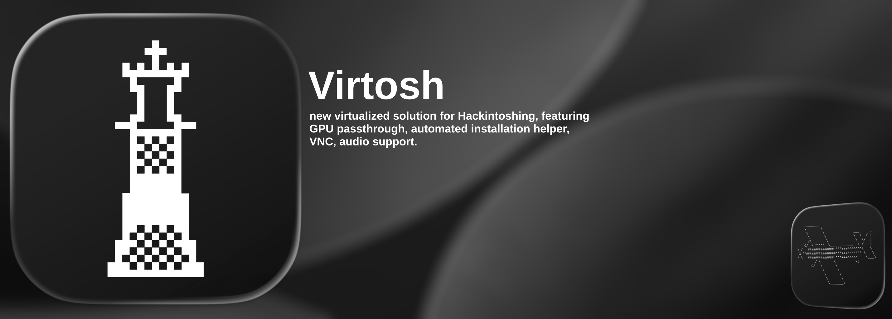

  
  
  
  

---

### Virtosh is a new solution for Virtualized Hackintosh-ing, it supports up to MacOS Tahoe (26), has automated install helper, supports custom configuration and has proper GPU Pass-through.

***

<h3>macOS Tahoe (26) Update Available Now</h3>

macOS Tahoe has been tested, it did boot and work, it is usable but **note that it is not as smooth as <26**

 

You can download the latest recovery image from AutoPilot.

 

<a href="https://github.com/qveezzx/Virtosh-KVM/releases">

***

⚠️ PLEASE NOTE THAT THIS WAS NOT MEANT TO BE DAILY DRIVE SOLUTION ⚠️

###  Features

Autopilot (NEW)

  
- Automated Recovery .dmg installation
- Convertion from .dmg to .img automatically
- No need to play with text configs, everything is ready to choose by user
- Auto-Updater
- Automatic .sh creation and permissions managing

MacOS Versions

  
- Tahoe (Beta)
- Sequoia
- Sonoma
- Ventura
- Monterey (Recommended for no accelerated Guest)
- Big Sur
- Catalina
- Mojave
- High Sierra
- Sierra
- El Capitan
- Yosemite
- Mavericks
- Mountain Lion
- Lion
(Please note that < Sierra was NOT tested)

Overall Features

  
- VFIO-PCI Passthrough Assistant 
- USB Passthrough Assistant
- OpenCore Configuration Assistant
- GenSMBIOS Integration
- Boot Argument Assistant + AutoPatch
- Automatic System Checks
- GPU Compatibility Checker
- VFIO-IDs and IOMMU Helpers
- Convert to XML for virt-manager
- AutoPilot

[Requirements]

MINIMAL REQUIREMENTS:
  
- 8GB of RAM
- ~2014 Intel or AMD with Virtualization and 2 Cores
- SATA HDD
- 40GB Space Left
- UEFI with Virtualisation Support
- Linux Installed (WSL is NOT supported.)

---

### How to use

Make sure you are using Linux like Arch, Ubuntu, Debian, Manjaro, Mint - does not really matter as long as they are having packages manager and WM/DE.

> [!NOTE]  
> WSL is NOT supported, the QEMU most likely will NOT boot or just show black screen.

# OSX Setup

1. Download latest Source Code from releases or clone this repository.
2. In root directory, run `./virtosh.sh` - if does not work, run `chmod +x ./virtosh.sh` then retry the `.virtosh.sh`. The dependencies most likely will install automatically, if not, check Official Documentation.
3. Either set everything up manually or using "Autopilot".
4. Boot using your new generated `.sh` (boot.sh if left default), e.g. `./boot.sh`.
5. Check Official Documentation to go past the setup.

---

### Known Issues

> Some Display Adapters not working/freezing Guest
>
> Solution: Make sure you are not using Window Manager, either switch to DE or use default Adapter.

---

### Preview

---

This project continues the development of Coopydood’s ultimate-macOS-KVM, originally © Coopydood.
While some file headers may indicate © qveezzx for improvements, maintenance and modifications, the original copyright of the original files remains with Coopydood.
All enhancements, maintenance and new contributions by qveezzx are licensed under GPL 3.0.

